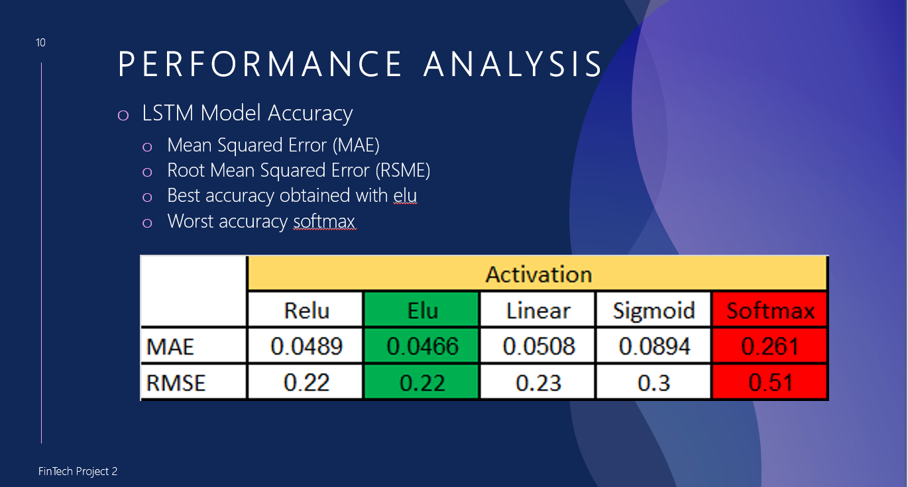
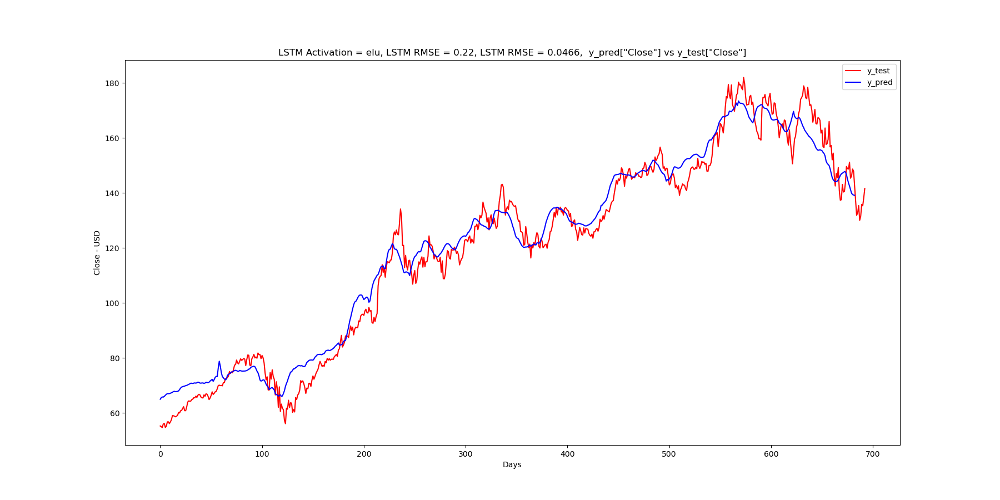
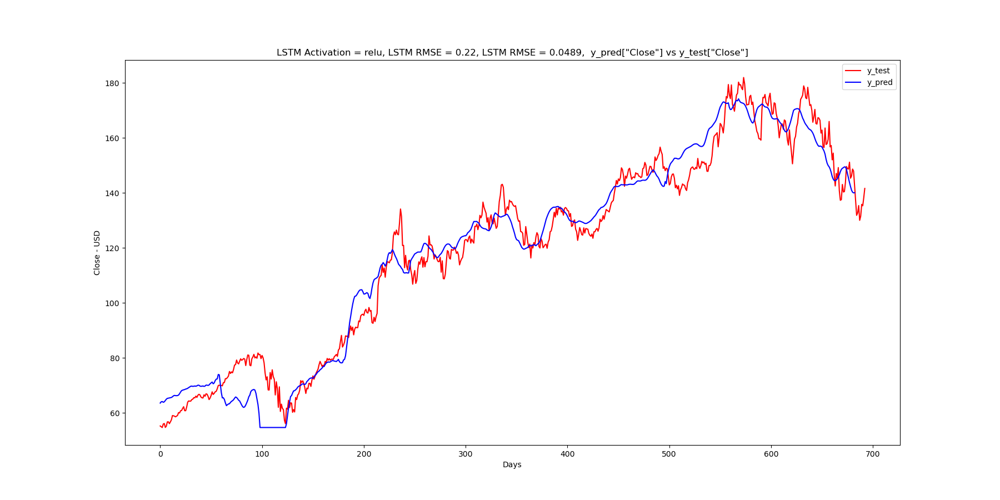
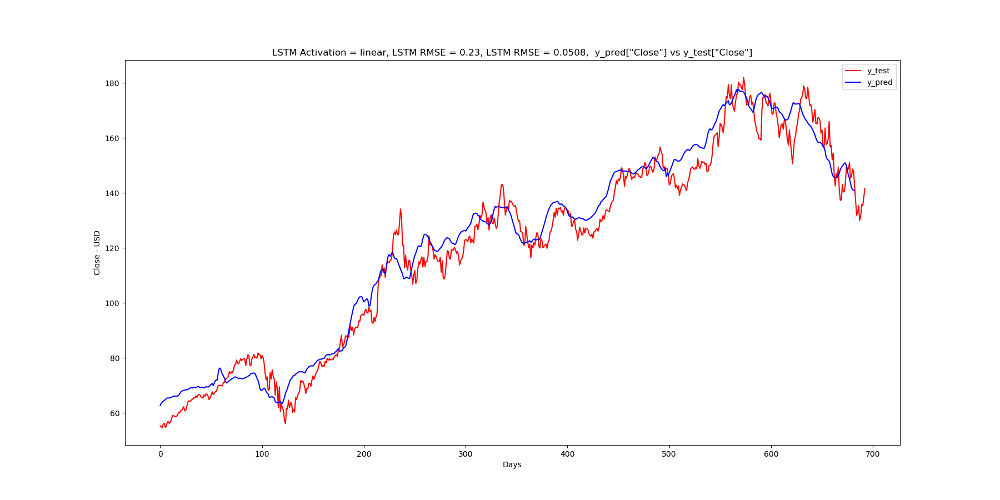
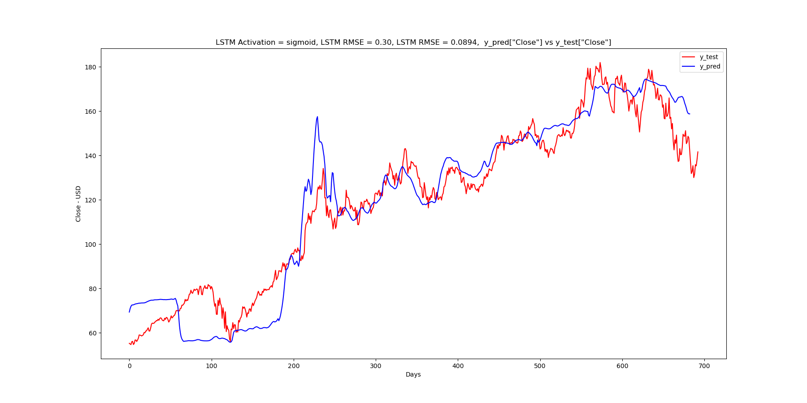
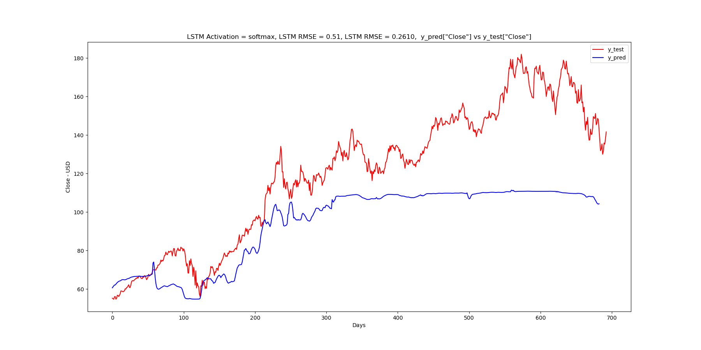

# LSTM Stock Predictor Based on Company Fundamentals
---

# Overview
The goal of the LSTM stock predictor based on company fundamentals is to build a stock predictor LSTM model to predict the movement of the stock market using the machine learning ML) techniques and the fundamental characteristics of a company.

The main functionalities include:
- Historical fundamental features data collection and cleaning
- Stock market data collection and cleaning
- Merging the fundamental features data and the stock daily closing price
- Build the LSTM Neural Network model to predict the stock 

# Data preparation and cleaning
## Historical fundamental features data collection
The historical fundamental dataset is collected using Intrinio (www.intrinio.com) API. Intrinio offers a 7-day free trial API to collect 10 years of a company historical fundamental data. [The API delivers the fundamental data in JSON format.](file://data/raw_fundamentals_json.txt)

The raw dataset has 134 features quaterly reports. The raw data is received in JSON format and converted into a dataframe which is saved as a CSV file for offline access. The data is cleaned to remove zeros and NaN values.

The original data in quarterly format is converted to daily format by using pandas fill froward function

Only the relevant features of the fundamental data are kept. The remaining features are dropped. The following features are kept:

    Date
    Ticker
    Quarterly operating income
    Quartely revenue
    Quartely net income
    Total asset
    Shareholder's equity
    EEPS(Basic) incl. Extraordinary items
    Common Equity
    Common Shares Outstanding
    Dividends per share
    Current assets
    Current liabilities
    Cash & Equivalent
    Recievalbles
    Cost of  Goods Sold
    Inventories
    Account payable
    Long term debt
    Debt in current liabilites
    Liabilities  
    

## Daily stock price collection
The daily historical Apple stock price from 1980 to 2022 is collected using Yahoo finance API. The data is cleaned to reomve NaN and zero values. Only the Close and Volume columns are kept for the prediction. All the remaining columns are dropped from the data

## Merging the daily stock Close and Volume with the features of the fundamental dataset
The stock data and the fundamental dataset are concatenated into a single dataframe. The two data dataframes are merged such that each row of the merged data contains the information from the same day for both datasets. When a specific date is in one of the two dataset, but it is not in the other dataset set it is dropped.

# Building LSTM Model
1. Normalize the data
2. Split the data into traning and test 
3. Standardize the data
4. Build the LSTM model
5. Compile the model
6. Fit the model
7. Evaluate the model on the test data
7. Predict values from test data trained using training data
8. Visualise the Close price predictions

# Results and Analysis
## LSTM Peformance Analysis

## Elu activation
- Activation elu, Mean Squared Error (MAE) = 0.0466, Root Mean Squared Error (RSME) = 0.22
- Prediction Accuracy = ± 0.22

## Relu activation
- Activation relu, Mean Squared Error (MAE) = 0.0489, Root Mean Squared Error (RSME) = 0.22
- Prediction Accuracy = ± 0.22

## Linear activation
- Activation linear, Mean Squared Error (MAE) = 0.0508, Root Mean Squared Error (RSME) = 0.23
- Prediction Accuracy = ± 0.23

## Sigmoid activation
- Activation sigmoid, Mean Squared Error (MAE) = 0.0894, Root Mean Squared Error (RSME) = 0.3
- Prediction Accuracy = ± 0.3

## Softmax activation
- Activation softmax, Mean Squared Error (MAE) = 0.261, Root Mean Squared Error (RSME) = 0.51
- Prediction Accuracy = ± 0.51

# Packages used
- Pandas
- Numpy
- yfinance
- Intrinio API
- Keras
- Scikit-learn
- urllib3
- json
	
## To run the model:
1. Run the notebook prep_data_daily_apple_fundamentals.ipynb
2. Run the lSTM model notebook lstm_daily_apple_fundamentals.ipynb
# Contributors
---
	Bakary Sylla, Yadisa Joiner, Marcus LeGare

# License
---
MIT
